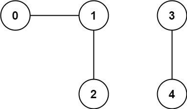
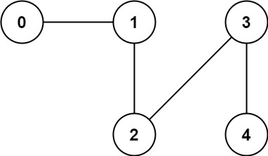

# **Union-find**

>Keywords: Graph, Set

## **Situation**
???+question "Situation"

    Need to process the structure of `disjoint-set` (which has no overlapping with other disjoint subsets).

    A `union-find` algorithm can help to do below two things:

    - **Find:** <u>Determine which subset a particular element is in</u>. This can be used for determining if two elements are in the same subset.
    - **Union:** <u>Join two subsets into a single subset</u>. Here first we have to check if the two subsets belong to same set. If no, then we cannot perform union. 

## **Question Example**
???+question "323. Number of Connected Components in an Undirected Graph"

    You have a graph of `n` nodes. You are given an integer `n` and an array `edges` where `edges[i] = [ai, bi]` indicates that there is an edge between `ai` and `bi` in the graph.

    Return the number of connected components in the graph.

## **Example**
???+example "Example"

    === "Example 1:"

        {width=40%, : .center}  

        * **Input:** `n` = 5, `edges` = [[0,1],[1,2],[3,4]]
        * **Output:** 2


    === "Example 2:"

        {width=40%, : .center}    

        * **Input:** `n` = 5, `edges` = [[0,1],[1,2],[2,3],[3,4]]
        * **Output:** 1


## **Pseudo-code**
???+success "Basic code structure"

    ``` c++ title="Basic"
    class Solution {
    private:
        vector<int> parents;
        int find(int x) {
            while (x != parents[x]) {
                parents[x] = parents[parents[x]];  // compression
                x = parents[x];
            }
            return x;
        }
        bool unions(int p, int q) {
            int x = find(p);
            int y = find(q);
            if (x != y) {
                parents[x] = y;
                return true;
            }
            return false;
        }
    public:
        int countComponents(int n, vector<pair<int, int>>& edges) {
            parents.resize(n);
            for (int i = 0; i < n; i++) {
                parents[i] = i;
            }
            int count = n;
            for (const auto& edge: edges) {
                if (unions(edge.first, edge.second)) {  //for each edges check if they are "unionable"
                    --count;
                }
            }
            return count;
        }
    };
    ```

## **Answer**
???+success "Simplified Solution"

    ``` c++ title="solution.c++"
    class Solution {
        int countComponents(int n, vector<pair<int, int>>& edges) {
            vector<int> p(n);             //sets

            iota(begin(p), end(p), 0);    //indexing
            //equivalent sentence:
            //for (int i=0; i<n; i++)
            //    p[i] = i;

            for (auto& edge : edges) {
                int v = edge.first, w = edge.second;
                while (p[v] != v) v = p[v] = p[p[v]];  //find1
                while (p[w] != w) w = p[w] = p[p[w]];  //find2
                p[v] = w;                 //union
                n -= v != w;              
            }
            return n;
        }
    };
    ```

### **References**

[C++ basic Union find solution, and BFS solution](https://leetcode.com/problems/number-of-connected-components-in-an-undirected-graph/solutions/77643/c-basic-union-find-solution-and-bfs-solution/)

[Short Union-Find in Python / Ruby / C++](https://leetcode.com/problems/number-of-connected-components-in-an-undirected-graph/solutions/77625/short-union-find-in-python-ruby-c/?orderBy=most_votes)

