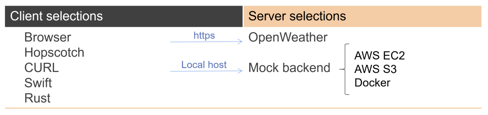
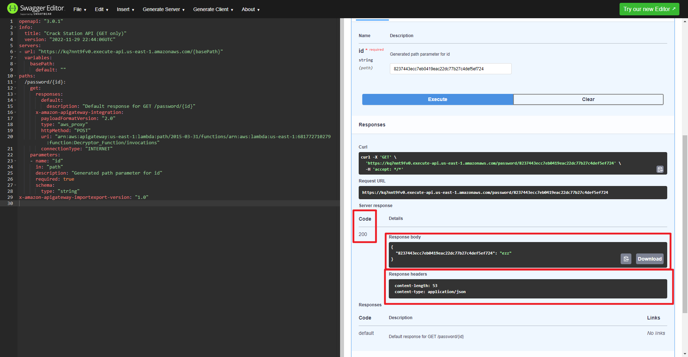

# **:material-connection: REST API**

> `REST API`, also known as `RESTful API`, is a web service that allows various clients
 including browser apps to **communicate** with a server.

## **Basic Knowledge**

### **REST**

???+question "`REST`?"

    - **Definition:** Representational State Transfer. It describes a way how a **clients** and **servers** interact with each other. 
  
    - **Property:** REST conforms to specific **architectural** constraints, like *stateless communication* and *cacheable data*. 

    ???+note "Operating principle"

        `REST` communication typically **bases on** [**HTTP**](../Web/Protocols/HTTP.md) protocol (but that isn't a requirement). **Requests** are made to a resource URI, possibly containing additional request data. **Replies** can be anything: `HTML`, `XML`, `JSON ([RFCs 8259](https://www.rfc-editor.org/rfc/rfc8259))`, `CSV`, `plain-text`, or even `raw binary data`. 

    ???note "Benifits"

        - Scalability :arrow_up:
        - Independent :arrow_down:
        - Generality :arrow_up:
        - Latency :arrow_down:
        - Security :arrow_up:
        - Legacy :white_check_mark:
        - Stateless :white_check_mark:

### **REST over HTTP (request to backend)**

???+note "notes"

    In computer programming, `create`, `read`, `update`, and `delete` (**CRUD operations**) are the four basic operations of persistent storage.

    Each letter in the acronym may be mapped to a **Hypertext Transfer Protocol (HTTP)** method:

    CRUD | HTTP | Details
    :-:|:-:|:-
    Create| `POST`, `PUT` if we have `id` or `uuid` | submits new data to the server.
    Read| `GET` | retrieves resources.
    Update| `PUT`, `PATCH` | updates existing data (specific one).
    Delete| `DELETE` | removes data.

    ???+example "Example"

        We can refer to the code described in [Express.js](../Backend/expressjs.md) to learn how to implement `CRUD`    operations using `Javascript`.

### **REST Response (response to frontend)**

Number | Meaning
:-:|:-
2XX| **Success**
4XX| **Client** Problem
5XX| **Server** Problem

### **Implementation Sketch**

{width="80%", : .center} 

## **REST API**

???+question "`REST API`?"

    `API`: application programming interface.

    To access a REST service, the **client** needs to know the `REST API` that the service if offering, so there must be documentation, and <u>you need to write code according to that documentation</u>. 
    
    With `OpenAPI` this step is automated. With `OpenAPI`, there exists a machine parseable file that explains to computers how a `REST API` works. It tells the code **what requests exist** and **what replies to expect**.

    ???+question "`Open API`?"
    
        Suppose you have an OpenAPI implementation and an OpenAPI description file of a REST API. In that case, you can feed that description file to the OpenAPI implementation, and this implementation now knows how to use the REST API, it can generate human-readable documentation for you, or it could even auto-generate code to use the REST API in different languages.

    ???+example "Example: Happy Day!"

        {width="80%", : .center}

### **References:**

- [Best practices for REST API design](https://stackoverflow.blog/2020/03/02/best-practices-for-rest-api-design/)

- [Open API vs. REST API - difference](https://stackoverflow.com/questions/48123867/open-api-vs-rest-api-difference)
