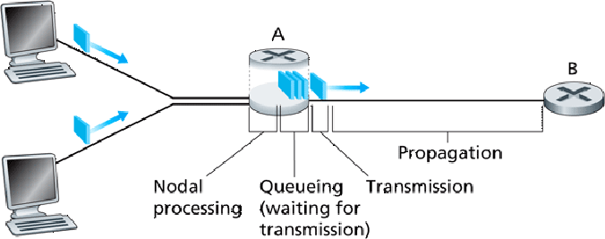

# **:material-network-outline: Performance Indices**

## **Speed**

???+question "Networking `speed`?"

    The data (bit: `0` or `1`) transmission speed.

    **e.g.** `bps` or `bit/sec` -- bits per second
    
    - `Mbps`: **1,000,000 bit/s**, is how many **millions of bits** a network can theoretically transfer each **second**. 	
    - `mbps`: **0.001 bit/s**.
    - `kbps`: **1,000 bit/s**.
    - `Gbps`: **1,000,000,000 bit/s**.

## **Bandwidth**

???+question "Networking `bandwidth`?"

    Maximum **amount of data** your connection can handle at **a moment (normally a second)**.

    **e.g.** Ethernet bandwidth: `10 Mbit/s` --> the maximum amount of data can be transferred in a second is **10 Mbit**.

## **Throughput**

???+question "Networking `throughput`?"

    The amount of data **passing through** a network (or channel, or interface) in a unit time.

    **e.g.** We can understand it as real-time "traffic" on a "bandwidth lane". But the number of "cars" cannot be more than the number the "bandwidth lane" allows.

## **Delay**

???+question "Networking `delay`?"

    The **time** (`s`) required to travel from **one end** of a network to **another end**.

    {width="60%", : .center}  

    There are **4** types of delays, corresponding to the concepts shown in the picture above:

    ???+example "Transmission delay"

        The `transmission delay` measures the speed of **data**. 
        
        It's the time from when the **first bit** of a file <u>reaches a link</u> to when the **last bit** <u>reaches the link</u>.

        $$Transmission\:Delay = \dfrac{L(bis)}{R(bits/sec)}$$

        $L$ is the file size (bits). $R$ is the [transmission speed](#speed) (bits/sec).

    ???+example "Propagation delay"

        The `propagation delay` measures the speed of the **medium**. 
        
        It's the amount of time **a bit** on the link needs to travel from the **source** to the **destination**, where the speed is dependent on the **medium** of communication.

        $$Propagation\:Delay = \dfrac{D(m)}{S(m/s)}$$

        $D$ is the distance (meter). $S$ is the propagation speed (meter/sec).

    ???+example "Queuing delay"

        The `queuing delay` measures the **buffering** rate. 
        
        If a packet arrives at its destination and the destination is busy, it will not handle that packet immediately. Instead, the packet has to wait in the `input/output queues`. 
        
        This delay depends on the following factors:

          - The number of **packets arriving** in a short time interval.
          - The **transmission capacity**.
          - The size of the **queue**.

    ???+example "Processing Delay"

        The `processing delay` measures the speed of the **processor (router or host machine)**.
        
        It is the time taken by a processor to **process the data** packet. 

## **Round-Trip Time**

???+question "Networking `Round-Trip time`?"

    The **duration** in milliseconds (ms), taken by the network to go from a start-point **sending a request** to the start-point **getting the response** that the end-point has received the data.

## **Bandwidth-Delay Product**

???+question "Networking `bandwidth-delay product`?"

    $$Transmission\: delay\times Bandwidth$$

### **References**

[What are the different kinds of computing network delays?](https://www.educative.io/answers/what-are-the-different-kinds-of-computing-network-delays)

[Picture resource](https://phoenix.goucher.edu/~kelliher/s2011/cs325/jan31img1.png)