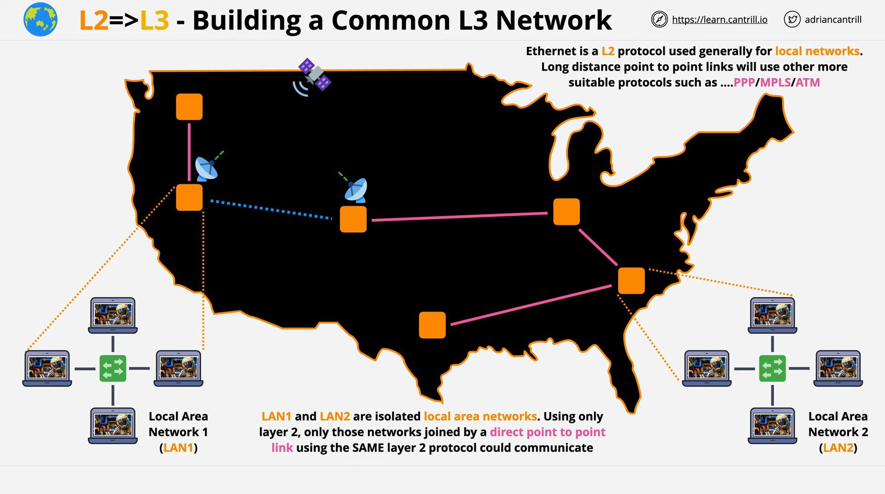
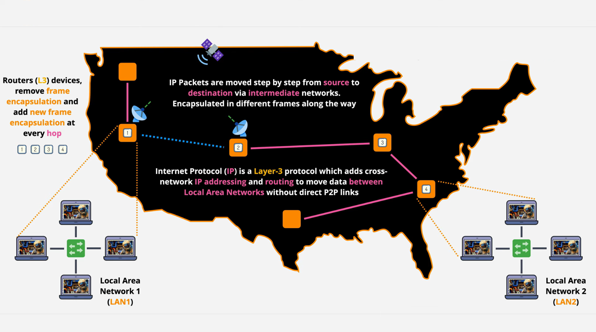
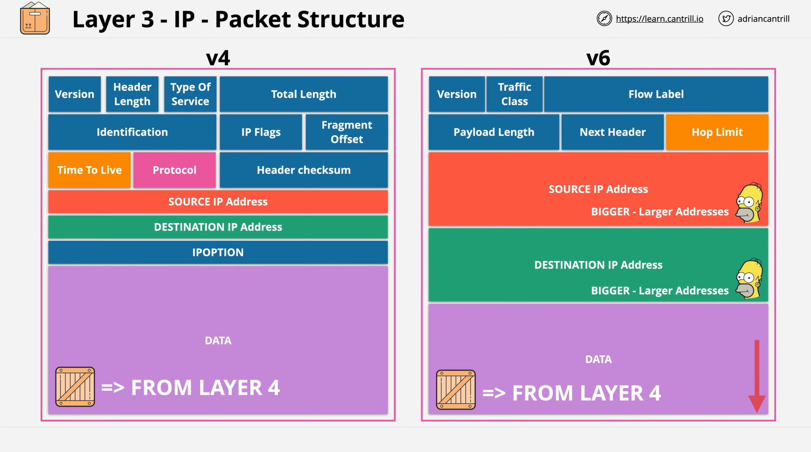

# **:material-ip-network: Network Layer**

{width="80%", : .center} 

## **Definition**

???+question "Demand?"

    **Data** need to be transferred from one {==location==} to another.

???+question "Why don't we use `Data Link Layer`?"

    If we need the **data** to be transferred from the <u>western coast `LAN`</u> to the <u>eastern coast `LAN`</u> across the US, we have the below plans:
    
    - **Plan A:** LAN is limited locally. So we should use other long-distance links such as using `PPP`/`MPLS`/`ATM`. Obviously, building specific `p2p` networking is costly and messy. 
    - **Plan B:** The `protocols` used in the `Layer2 network` are not always the same. Compatibility is a problem.

    {width="100%", : .center}    

???+question "How?"

    To solve this problem, we need to import a new layer. `Layer3` -- `Network Layer` is where `Internetworking` comes from. 
    
    We need to use `IP protocol` and `IP packets`.

    {width="100%", : .center}

## **IP packets**

???+question "`IP packets`?"

    `IP packets` is the data unit used within the **Internet Protocol**. It is similar to `frame` in the [`Layer 2`](./datalink.md). 
    
    `Datagram` is an alternative term for "packet".

???+note "Structure"

    There are two types of IP packets for `IPv4` (Internet Protocol version 4) and `IPv6` (Internet Protocol version 6):

      

### **References**

[Networking Fundamentals: OSI 7 - Layer 3 - the network layer - Part 1](https://www.youtube.com/watch?v=WAZxo2ObFIw&list=PLTk5ZYSbd9Mi_ya5tVFD8NFfU1YZOyml1&index=7)
