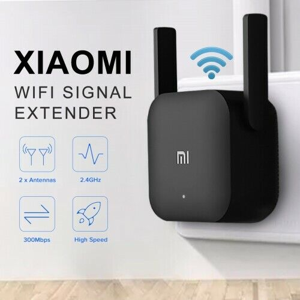
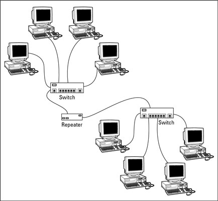

# **:material-expansion-card-variant: Physical Layer**

{width="80%", : .center} 


## **Definition**

???+question "What?"

    Instead of representing [physical mediums](#transmission-mediums), `physical layer` is a {==**standard**==}:

    - {++Electrical Specification:++} The **logic level** is used in `+10v ~ +15v` to represent binary `0`; `-10v ~ -15v` to represent binary `1`.
    - {++Physical Specification:++} Such as *timing*, *rates*, *distances*, *modulation*, and *connectors*.
    - {++Rules:++} For **transmission media interfaces** -- transmission and reception of raw `bit streams`.

## **Transmission Mediums**

???+success "Transmission Mediums"

    There are **three** major types:
            
    1. **Copper** (electrical).
    2. **Optical Fiber** (light).
    3. **WIFI** (RF).

???+note "Optical Fiber for network?"

    Principles of `optical fiber` communication:

    ``` mermaid
    graph LR
        A["Device (network card)"]-- electrical signal -->B([transportation])
        subgraph Optical Fiber
        B-. optical pulse .->C([Before the server])
        end
        C-- electrical signal -->D[server]
    ```

    ???+question "Why faster?"

        In the time sequence, turning **on** the light pulse means `1`, and turning **off** the light pulse means `0`. 
        
        Since the **frequency** of visible light is about `10~8 MHz`, the [bandwidth](./../Indices.md/#bandwidth) of the `optical fiber` communication system is **much larger** than that of other transmission media.

???+note "Repeater?"

    ???+question "Background?"

        The `signal power` transmitted on the [physical medium](#transmission-mediums) will **gradually decay**. When the attenuation reaches a certain level, the <u>signal will be distorted</u>. Thus the `reception error` will be caused.

    ???+question "What?"

        `Repeater` is a device that can **regenerate** and **restore** the signal to <u>increase the transmission distance</u> of the signal.

        ???+warning "Note!"

            The two ends of the repeater are connected to different `network segments`, **NOT** `subnets`.

    ???+example "Example!"

        - **wireless:** Normally, we can see a wireless `repeater` as a `WIFI extender`. There is a free Ad. here 😆:

            {width="50%", : .center}   

        - **wired:** The old school uses wired ones:

            {width="50%", : .center}  


## **Cons**

???+warning "Cons of Physical Layer"

    There are **three** major cons that `Physical Layer` has:

    1. No access control (**e.g.** "entrance guard").
    2. No collision detection (**e.g.** "traffic police") --> there are collisions.
    3. No uniquely identified devices (**e.g.** "workers without names in one office").
    4. No device communications (**e.g.** "cannot find specific worker since he/she doesn't have a name").

### **References**

[Network Byte](https://www.pinterest.co.uk/346e0552cdcca5443977884464e47f/)

[Xiaomi Exterder](https://i.ebayimg.com/images/g/kx4AAOSwXKVg58hN/s-l640.jpg)

[Network Basics: Repeaters](https://www.dummies.com/article/technology/information-technology/networking/general-networking/network-basics-repeaters-185332/)