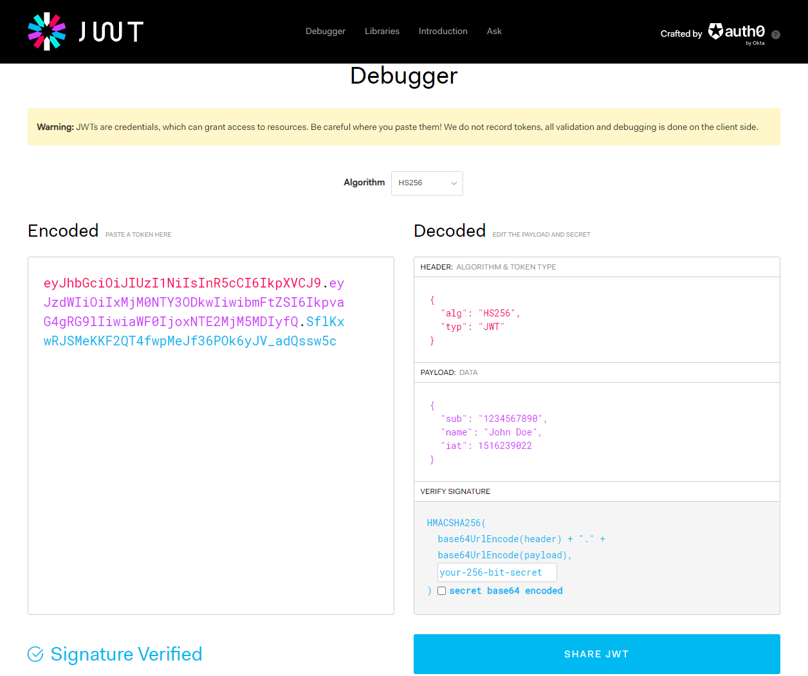
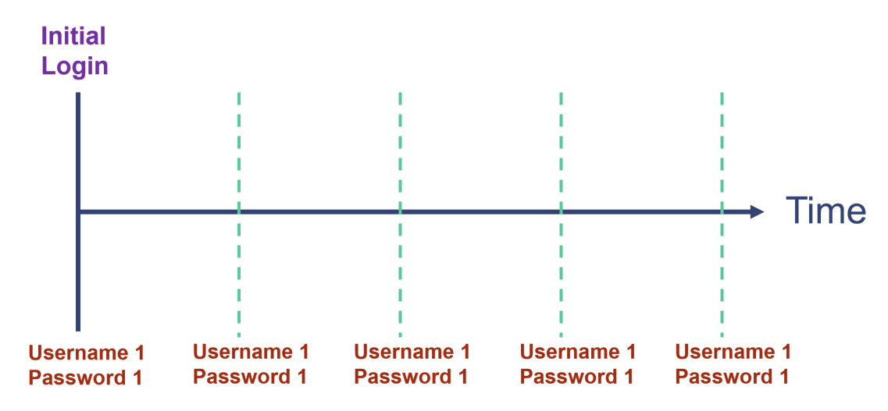
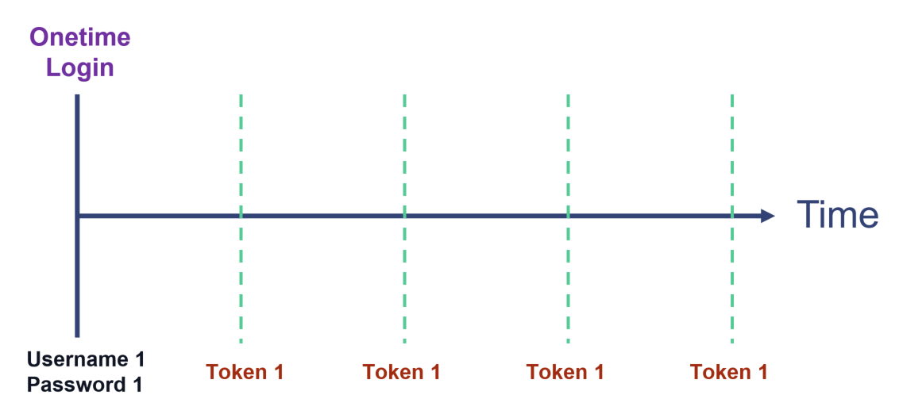
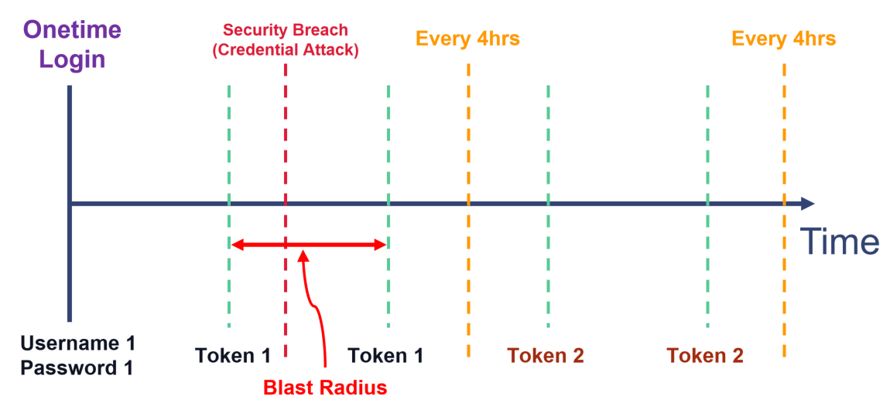
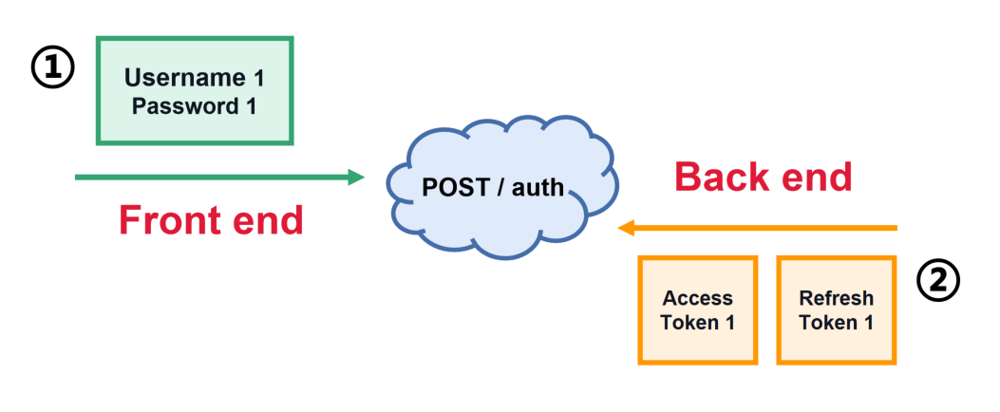
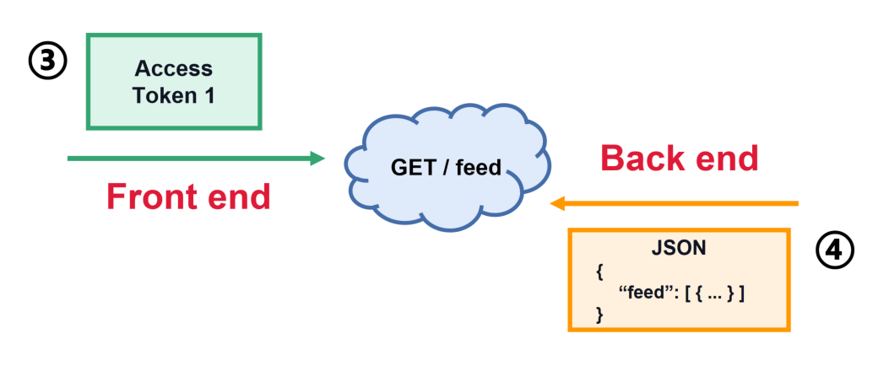
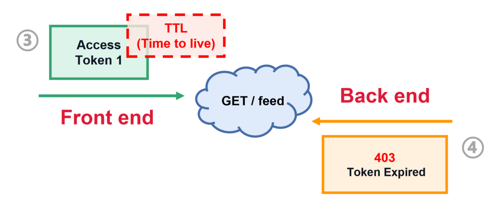
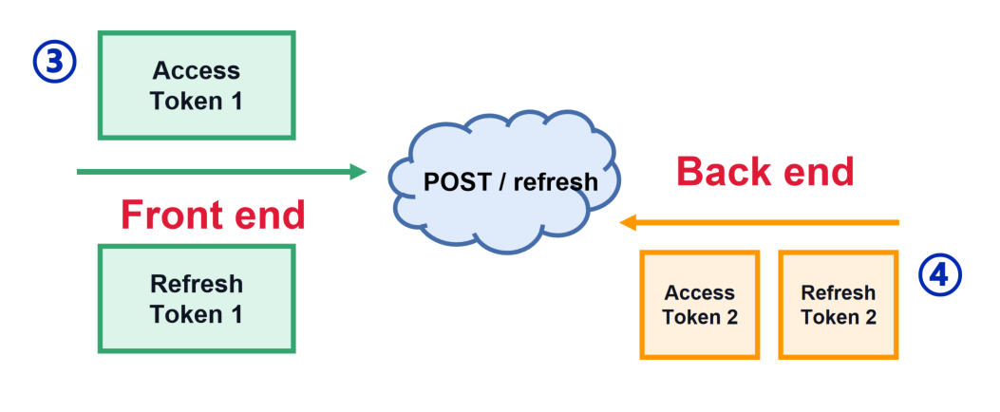
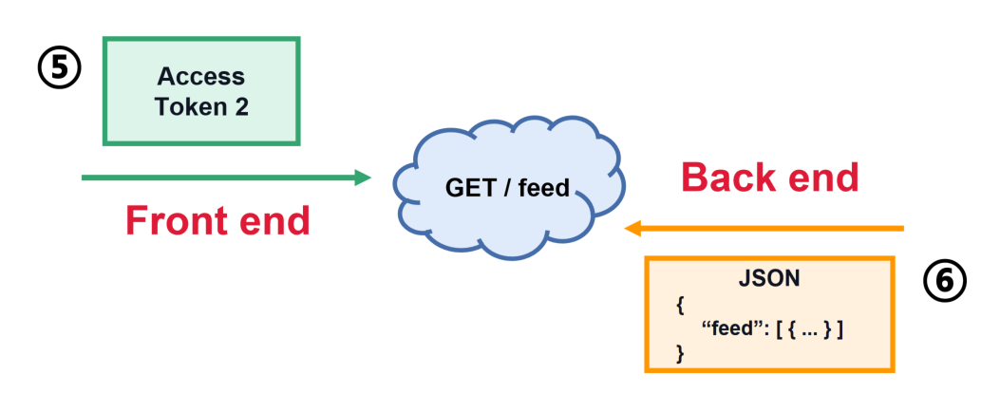

# **:octicons-browser-16: Auth**

## **Auth**

???+question "Auth?"

    `Auth` points to **Authentication** and **Authorization**. They come from [REST API](./../API/rest_api.md) communication. 

    - Without **Authentication** --> 401 (Do not know who you are).
    - Without **Authorization** --> 403 (Do not have permission to access resources).

## **Token**

To realize the two Auth principles. Including `Token` becomes essential.

???+question "Why `Token`?"

    Compared with **username & password**, tokens are **temporary**, stored in browser or device. When sessions complete or exceed the expiration time, not like username & password, they are automatically **destroyed**.

## **JWT.io**

???+note "`JWT.io` for `Token` generation"

    [`JWT.io`](https://jwt.io/) is constructed by below components:

      - **Header:** Identify:
        - Which **algorithm**(normally HS256) to generate the **signature**.
        - What token type (Here JWT).
      - **Payload:** A set of claims.
      - **Signature:** Securely **validates** the token, calculated by encoding the **header** and **payload** using [`Base64URL Encoding RFC 4648`](https://base64.guru/standards/base64url#:~:text=Base64URL%20is%20a%20modification%20of,characters%20for%20URLs%20and%20filenames.)

    {width="80%", : .center}  

## **How to use Token**

???+question "How to apply `Token`?"

    We **inject** tokens in the [HTTP](./HTTP.md) **header**.

## **OAuth 2.0**

???+question "Why need two `Tokens`?"

    It limits the `blast radius` of a `credential attack`.

    ???+example "Credential attack!"

        ???+note "Username-Password Auth"

            {width="60%", : .center}    

        ???+note "One Token Auth"

            {width="60%", : .center}    

        ???+note "Two Token Auth (OAuth 2.0)"

            {width="60%", : .center}    

## **Implement OAuth 2.0**

For the two tokens, one is named `Access Token`; another is named `Refresh Token`.

???+question "Difference between the two tokens?"

    - `Access token` have `"Time-to-live"`, which is the maximum that the access token will be valid for use within the application.

    - `Refresh tokens` have **longer** expiration times than access tokens. The exsistance of `refresh tokens` allows you to use shorter lifetimes for access tokens **WITHOUT** having to request user credentials multiple times.

???+note "Iterations Diagram"

    {width="60%", : .center}  

    {width="60%", : .center}  

    {width="60%", : .center}  

    {width="60%", : .center}  

    {width="60%", : .center}  

        

