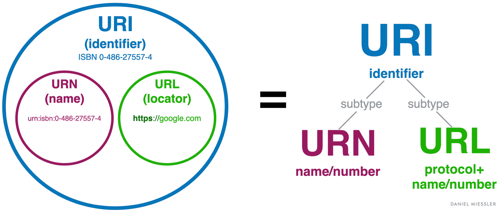
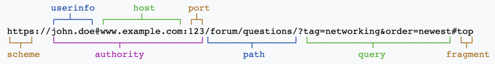

# **:octicons-browser-16: Uniform Resource Identifier(URI)**

> In web development we always say `endpoints`. The concept refers to `URI` + `HTTP request method` (GET, POST, etc.). So what is `URI`, what is the difference between `URI` and `URL`?

## **Definition**

???+question "What is `URI` and `URL`"

    - `URI`: Uniform Resource Identifier.
    
    - `URL`: Uniform Resource Locator. 

## **Difference**

???+question "Difference between `URI` and `URL`?"

    - `URI` identifies **a resource and differentiates it** from others by using a name, location, or both. 
    - `URL` identifies the **web address** or **location of a unique resource**. 

    {width="60%", : .center}  
    
    {width="60%", : .center}  

## **Syntax**

???+note "Syntax of `URI`/`URL`"

    
`{==scheme==}:[//{==authority==}]{==path==}[?{==query==}][#{==fragment==}]`

    {width="80%", : .center}  

    === "Scheme"

        The first component of a URI <u>defines the addressing system</u>: 

          1. in some cases, it is a **protocol** used to access a resource. 
          2. meanwhile, other techniques may NOT specify any **protocol**.

        `Scheme` can contain any combination of *letters*, *digits*, *plus signs*, *periods*, or *hyphens* followed by a colon. The most <u>common URI schemes</u> include `HTTP`, `HTTPS`, `FTP`, `mailto`, and `file`.  

        ???example "HTTP, HTTPS, and FTP"

            1. `HTTP` (Hypertext transfer protocol) – allows users to access data from web pages using hypertext links.
            2. `HTTPS` (Hypertext transfer protocol secure) – protects data transmission between the user’s browser and site.
            3. `FTP` (File transfer protocol) – used for a file transfer between different devices via a network.
    
        **e.g.** `{==file==}:website.com/pathtofile/intro.pdf`

    === "Authority Component"

        An optional component **preceded** by a *double slash* and **terminated** by a *slash*, a *question mark*, or a *hash symbol*. It consists of three sub-components:

          3. **Userinfo** – includes a `username` and a `password` separated by a colon.
          4. **Host** – consists of either an `IP address` or a `registered name`. The IP address should be inserted into brackets.
          5. **Port** – a `protocol` used for connecting the server. It is an optional sub-component followed by a colon.

        **e.g.** `file:(//){==website.com==}/pathtofile/intro.pdf`

    === "Path"

        The thrid component contains a sequence of data segments that **describes the location** of a resource in a directory structure. It should be **empty** or **separated by a slash**. 
        
        **e.g.** `telnet://192.0.2.16:80/{== ==}` (valid URI with an empty path)

        **e.g.** `foo://info.example.com{== ==}?fred` (valid URI with an empty path)

        **e.g.** `file:(//)website.com/{==pathtofile/intro.pdf==}`

    === "Query Component"

        A component that contains a **query** string of non-hierarchical data. It is often a string of `key=value` pairs. This component is **preceded** by a `question mark`. 
        
        **e.g.** `https://example.org/test/test1?{==search=test-question==}#part2`

    === "Fragment Component"

        This optional component includes a fragment identifier that provides the **direction to a secondary resource**. A fragment is **preceded** by a `hash symbol` and **terminated** by the end of a URI.

        **e.g.** `https://example.org/test/test1?search=test-question#{==part2==}`

### **References:**

- [URI vs URL: Differences and When to Use Them](https://www.hostinger.com/tutorials/uri-vs-url#:~:text=URI%20identifies%20a%20resource%20and,a%20domain%20name%20and%20port.)

- [picture resource 1](https://danielmiessler.com/images/uri-url-urn-hierarchy-miessler-2022.png)

- [picture resource 2](https://danielmiessler.com/images/uri-breakdown-2022-1024x135.png)