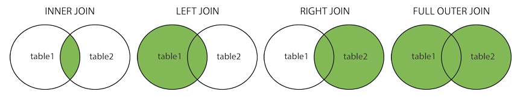

# ** :simple-mysql: Multiple Table Operation**

### **Glance of contents**

Here are some higher-level uses:

- [`Joins`](#select-distinct) - Basic Join Concept.
- [`Inner Join`](#inner-join) - Inner join two different tables.
- [`Left Join`](#left-join) - Left join two different tables.
- [`Right Join`](#right-join) - Right join two different tables.
- [`Full Join`](#full-join) - Outer join two different tables.
- [`Self Join`](#self-join) - Inner join a table with itself.
- [`Union`](#union) - Combine two tables with the same number of columns.

## **Joins**

???note "Joins"

    Here are the different types of the `JOINs` in SQL:

    - `(INNER) JOIN`: Returns records that have matching values in both tables
    - `LEFT (OUTER) JOIN`: Returns all records from the left table, and the matched records from the right table
    - `RIGHT (OUTER) JOIN`: Returns all records from the right table, and the matched records from the left table
    - `FULL (OUTER) JOIN`: Returns all records when there is a match in either left or right table
  
    {width="80%", : .center}     

## **Inner Join**

???note "Inner Join"

    ???+success "Syntax"

        ``` sql
        SELECT column_name(s)
        FROM table1 INNER JOIN table2
        ON table1.column_name = table2.column_name;
        ```

    ???example "click to see an example"

        <div data-pym-src='https://www.jdoodle.com/plugin' data-language="sql"
          data-version-index="0">
        CREATE TABLE Marks_family (
            PersonID int,
            City varchar(255)
        );
        CREATE TABLE Student_List (
            StudentName varchar(255),
            City varchar(255)
        );
        INSERT INTO Marks_family (PersonID, City)
        VALUES (123, 'Albany');
        INSERT INTO Marks_family (PersonID, City)
        VALUES (124, 'Salem');
        INSERT INTO Student_List (StudentName, City)
        VALUES ('Tonny', 'Albany');
        INSERT INTO Student_List (StudentName, City)
        VALUES ('Daming', 'Salem');
        INSERT INTO Student_List (StudentName, City)
        VALUES ('King', 'Euguene');
        \ 
        SELECT Marks_family.PersonID, Marks_family.City, Student_List.StudentName
        FROM Marks_family INNER JOIN Student_List
        ON Marks_family.City = Student_List.City;
        </div> 

## **Left Join**

???note "Left Join"

    ???+success "Syntax"

        ``` sql
        SELECT column_name(s)
        FROM table1 Left JOIN table2
        ON table1.column_name = table2.column_name;
        ```

    ???example "click to see an example"

        <div data-pym-src='https://www.jdoodle.com/plugin' data-language="sql"
          data-version-index="0">
        CREATE TABLE Marks_family (
            PersonID int,
            City varchar(255)
        );
        CREATE TABLE Student_List (
            StudentName varchar(255),
            City varchar(255)
        );
        INSERT INTO Marks_family (PersonID, City)
        VALUES (123, 'Albany');
        INSERT INTO Marks_family (PersonID, City)
        VALUES (124, 'Salem');
        INSERT INTO Student_List (StudentName, City)
        VALUES ('Tonny', 'Albany');
        INSERT INTO Student_List (StudentName, City)
        VALUES ('Daming', 'Salem');
        INSERT INTO Student_List (StudentName, City)
        VALUES ('King', 'Euguene');
        \ 
        SELECT Marks_family.PersonID, Marks_family.City, Student_List.StudentName
        FROM Student_List LEFT JOIN Marks_family
        ON Student_List.City = Marks_family.City;
        </div>

## **Right Join**

???note "Right Join"

    ???+success "Syntax"

        ``` sql
        SELECT column_name(s)
        FROM table1 RIGHT JOIN table2
        ON table1.column_name = table2.column_name;
        ```

    ???example "click to see an example"

        <div data-pym-src='https://www.jdoodle.com/plugin' data-language="sql"
          data-version-index="0">
        CREATE TABLE Marks_family (
            PersonID int,
            City varchar(255)
        );
        CREATE TABLE Student_List (
            StudentName varchar(255),
            City varchar(255)
        );
        INSERT INTO Marks_family (PersonID, City)
        VALUES (123, 'Albany');
        INSERT INTO Marks_family (PersonID, City)
        VALUES (124, 'Salem');
        INSERT INTO Student_List (StudentName, City)
        VALUES ('Tonny', 'Albany');
        INSERT INTO Student_List (StudentName, City)
        VALUES ('Daming', 'Salem');
        INSERT INTO Student_List (StudentName, City)
        VALUES ('King', 'Euguene');
        \ 
        SELECT Marks_family.PersonID, Marks_family.City, Student_List.StudentName
        FROM Marks_family RIGHT JOIN Student_List
        ON Marks_family.City = Student_List.City;
        </div> 

## **Full Join**

???note "Full Join"

    ???+success "Syntax"

        ``` sql
        SELECT column_name(s)
        FROM table1 FULL OUTER JOIN table2
        ON table1.column_name = table2.column_name
        (WHERE/ORDER BY);
        ```

    ???example "click to see an example"

        <div data-pym-src='https://www.jdoodle.com/plugin' data-language="sql"
          data-version-index="0">
        CREATE TABLE Marks_family (
            PersonID int,
            City varchar(255)
        );
        CREATE TABLE Student_List (
            StudentName varchar(255),
            City varchar(255)
        );
        INSERT INTO Marks_family (PersonID, City)
        VALUES (123, 'Albany');
        INSERT INTO Marks_family (PersonID, City)
        VALUES (124, 'Salem');
        INSERT INTO Marks_family (PersonID, City)
        VALUES (127, 'Linclon');
        INSERT INTO Student_List (StudentName, City)
        VALUES ('Tonny', 'Albany');
        INSERT INTO Student_List (StudentName, City)
        VALUES ('Daming', 'Salem');
        INSERT INTO Student_List (StudentName, City)
        VALUES ('King', 'Euguene');
        \ 
        SELECT Marks_family.PersonID, Marks_family.City, Student_List.StudentName
        FROM Marks_family FULL OUTER JOIN Student_List
        ON Marks_family.City = Student_List.City;
        </div> 

## **Self Join**

???note "Self Join"

    A `self join` is a regular join, but the table is **joined with itself**.
    ???+success "Syntax"

        ``` sql
        SELECT column_name(s)
        FROM table1 T1, table2 T2
        WHERE condition;
        ```

    ???example "click to see an example"

        <div data-pym-src='https://www.jdoodle.com/plugin' data-language="sql"
          data-version-index="0">
        CREATE TABLE Marks_family (
            PersonID int,
            City varchar(255)
        );
        INSERT INTO Marks_family (PersonID, City)
        VALUES (123, 'Albany');
        INSERT INTO Marks_family (PersonID, City)
        VALUES (124, 'Salem');
        INSERT INTO Marks_family (PersonID, City)
        VALUES (127, 'Albany');
        \ 
        SELECT A.PersonID, A.City, B.PersonID
        FROM Marks_family A, Marks_family B
        WHERE A.City = B.City AND A.PersonID <> B.PersonID;
        </div> 

## **Union**

???note "Union"

    The `UNION` operator is used to **combine the result-set** of two or more SELECT statements.

    - Every `SELECT` statement within `UNION` must have the **same number of columns**
    - The columns must also have **similar data types**
    - The columns in every `SELECT` statement must also be in **the same order**
    - `UNION` selects only **distinct values**. Use `UNION ALL` to also select **duplicate values**!
    ???+success "Syntax"

        ``` sql
        SELECT column_name(s) FROM table1 (WHERE)
        UNION (ALL)
        SELECT column_name(s) FROM table2 (WHERE)
        (ORDER BY);
        ```

    ???example "click to see an example"

        <div data-pym-src='https://www.jdoodle.com/plugin' data-language="sql"
          data-version-index="0">
        CREATE TABLE Marks_family (
            PersonID int,
            City varchar(255)
        );
        CREATE TABLE Student_List (
            StudentName varchar(255),
            City varchar(255)
        );
        INSERT INTO Marks_family (PersonID, City)
        VALUES (123, 'Albany');
        INSERT INTO Marks_family (PersonID, City)
        VALUES (124, 'Salem');
        INSERT INTO Marks_family (PersonID, City)
        VALUES (127, 'Linclon');
        INSERT INTO Student_List (StudentName, City)
        VALUES ('Tonny', 'Albany');
        INSERT INTO Student_List (StudentName, City)
        VALUES ('Daming', 'Salem');
        INSERT INTO Student_List (StudentName, City)
        VALUES ('King', 'Euguene');
        \ 
        SELECT * FROM Marks_family
        UNION ALL
        SELECT * FROM Student_List;
        </div> 

### **References:**

- [SQL Tutorial](https://www.w3schools.com/sql/)


<script src="https://www.jdoodle.com/assets/jdoodle-pym.min.js" type="text/javascript"></script>