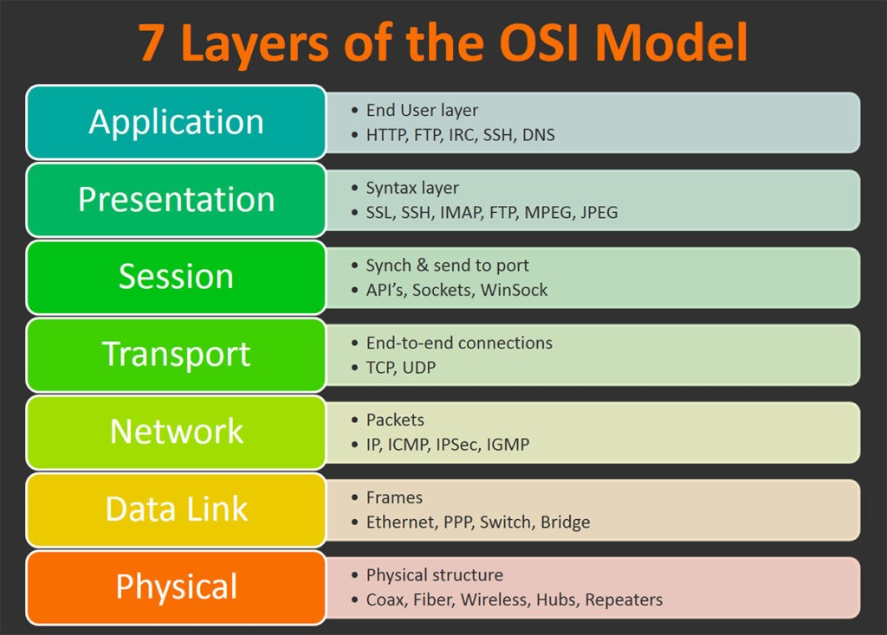

# ** :material-network-outline: OIS**

## **OIS Model**

`OIS` (Open Systems Interconnection) model can be split into 7 levels:

{width="70%", : .center}  

## **OIS Catlog**

1. [Physical Layer](./physical.md).
   
2. [Data Link Layer](./datalink.md).

3. [Network Layer](./network.md).

4. [Transport Layer](./transport.md).

5. [Session Layer](./session.md).

6. [Presentaion Layer](./presentation.md).

7. [Application Layer](./application.md).