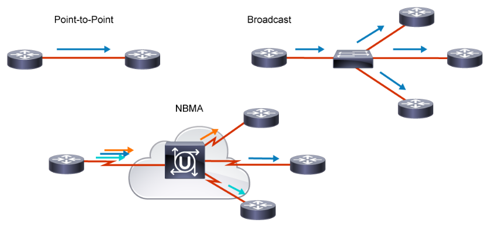
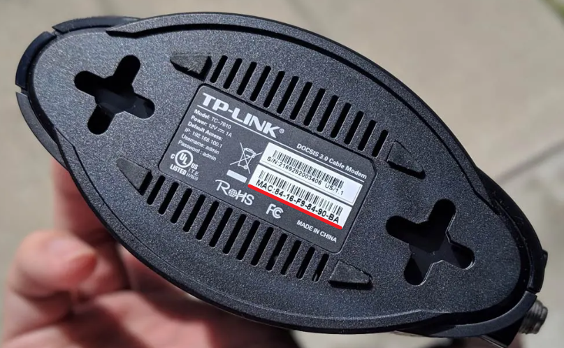
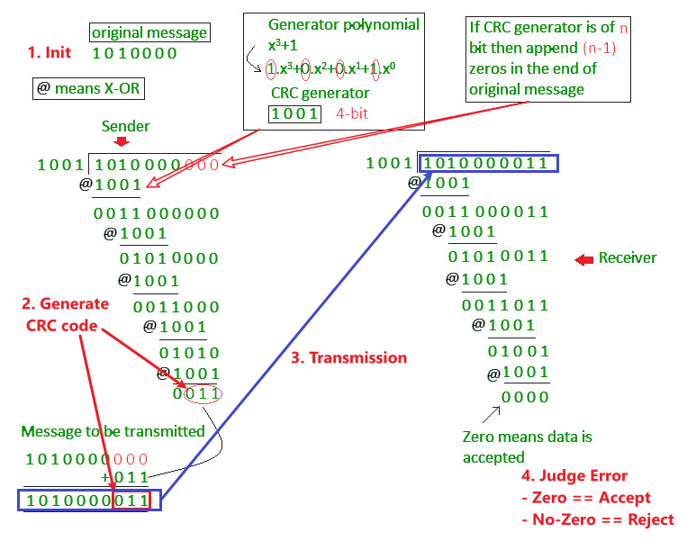
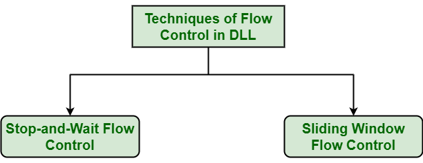
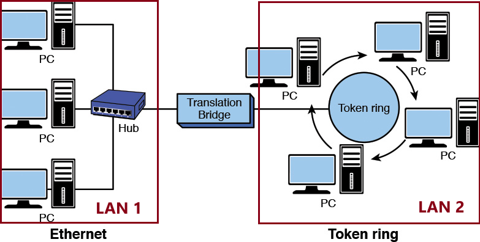
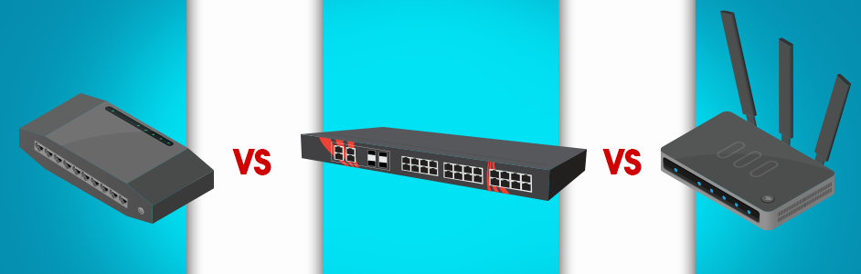

# **:material-bridge: Data Link Layer**

{width="80%", : .center} 


## **Definition**

???+question "Demand?"

    The `bitstream` can cause **errors** (see [physical layer's cons](./physical.md/#cons)) when it is transmitted on a medium. We need a **new layer** that provides {==high-quality (error free)==} data transfer services to topper layers (such as [network layer](./network.md)).

    ``` mermaid
    graph LR
        A[Network Layer] -- packets --- B[Data Link Layer]
        B -- "frames (bit-by-bit)" --- C[Physical Layer]
    ```

???+question "For?"

    `Data Link Layer` has below functions:

    1. [**Framing**](#11-framing). 
    2. [**Addressing**](#12-addressing).
    3. [**Transparent Transmission**](#13-transparent-transmission).
    4. [**Error Detection**](#21-error-detection)
    5. [**Error Correction**](#22-error-correction)
    6. [**Flow Control**](#23-flow-control)

## **Abstracting**

???+note "From `physical layer` to `data link layer`"

    We know that in the [`physical layer`](./physical.md), information is communicated with bit stream through <u>cable or WIFI</u>. 
    
    To abstract the `data link Layer`, we classify the <u>"communication channel"</u> in this layer into two types:

    1. **Point-to-point** communication channel (use [P2P](https://www.geeksforgeeks.org/p2ppeer-to-peer-file-sharing/) protocol).
    2. **Broadcast** communication channel (use [CSMA/CA](https://www.techtarget.com/searchnetworking/definition/CSMA-CA#:~:text=Carrier%20sense%20multiple%20access%2Fcollision%20avoidance%20(CSMA%2FCA),over%20a%20data%20link%20layer.) protocol).

    {width="80%", : .center}   


???+danger "Notice!"

    To understand the `data link layer` better, we think about the case of **broadcasting** first. 
    
    [LAN](https://en.wikipedia.org/wiki/Local_area_network) (local area network) is a computer network that has the **broadcasting** function.

    Furthermore, from all the `LAN` products, we peak [`Ethernet`](https://en.wikipedia.org/wiki/Ethernet), which fllow the standard of [*DIX Ethernet V2*](https://www.ibm.com/docs/en/zvm/7.1?topic=structure-ethernet-dix-v2) or [*IEEE 802.3*](https://en.wikipedia.org/wiki/IEEE_802.3).


### **Anatomy**

???+note "Dissect the `data link layer`"

    In order to make the `data link layer` more suitable for  various `LAN` standards, the [*802 committee*](https://en. wikipedia.org/wiki/IEEE_802) divided the `data link layer` into two **sub-layers**:

    - [**Logical Link Control (LLC)**](#llc-sub-layer): provides the logic for the data link.
    - [**Medium Access Control (MAC)**](#mac-sub-layer)：provides controls for accessing the transmission medium. It is transparent to `LLC` sublayer

    {width="30%", : .center}   

> Let's go to check them one by one! 🛸🛸 Drink some coffee first!
>{width="70%", : .center}  


## **1. MAC Sublayer**

### **Mac address**

???+question "MAC Address?"

    `MAC Address` is also called as the `physical Address` of a **network device**. `MAC Address` is used by the `MAC sublayer`. `MAC Address` is **worldwide unique** (since millions of network devices exist, we need to uniquely identify each). 

    {width="50%", : .center}


### **Functions of MAC Sublayer**

!!! note ""

    `MAC` sublayer is responsible for:

    1. [**Framing**](#11-framing)
    2. [**Addressing**](#12-addressing)
    3. [**Transparent Transmission**](#13-transparent-transmission)
    4. [**Control physical medium access**](#14-control-physical-medium-access)


### **1.1 Framing**

!!! success ""

    ???+question "`Framing`?"

        **Transfer** network data (a stream of `bits`) into `frames`, which is **discernible blocks** of information.

    ???+question "`Frame`?"

        **Transferred** `protocol data units` (**PDU**s) in the `data link layer`.

    ???+note "Types of `Framing`"

        {width="50%", : .center}     

        There are **two** types of `Framing`:

        - **Fixed-size Framing:**

            !!! example ""

                The `frame` is of **fixed size**. No need to add delimiters.

                ???warning "Con"

                    When the data size is **smaller** than the fixed frame size, the frame itself will suffer   <u>internal fragmentation</u>. We need to `pad` it.

        - **Variable-size Framing:**

            !!! example ""

                The `frame` needs to indicate the **begin** and **end** to be distinguished.

                ???+success "Ways to implement"

                    1. `Length field` : define the length **in** the frame.

                        - **e.g.** [Ethernet (802.3)](https://en.wikipedia.org/wiki/IEEE_802.3) --> `Ethernet frame`.
                        - **Cons:** Length field may get corrupted sometimes.

                    2. `ED (End Delimeter)` : add **end delimiter** (like [*Period*](https://en.wikipedia.org/wiki/ Full_stop) in English).

                        - **e.g.** [Token Ring (802.5)](https://en.wikipedia.org/wiki/Token_Ring).
                        - **Cons:** The end delimiter can appear in the data.
                        - **Types:** 
                            - Character/Byte Stuffing (see later in [1.2 Transparent transmission](#12-transparent-transmission))
                            - Bit Stuffing

    ???+note "Schematic Diagram of `Ethernet frame`"

        Here below is the `Ethernet frame` format:

        {width="80%", : .center}   
        
        1. The **Preamble** area is used by the **receiving interface’s circuitry** to determine when a frame arrives and the amount of time between encoded bits (called `clock recovery`).
   
        2. The **SFD** and **Preamble** area indicates when the frame start.

        3. The **Basic Frame** (/Frame) field starts from the `Destination (DST)` and `Source (SRC)` address fields. 
   
        4. Both **DST** (destination) and **SRC** (source) areas are all [MAC addresses](#mac-address) or known by other names such as:
            - Link-layer address
            - 802 address
            - Hardware address
            - Physical address

        5. The **Type/Lenth** area identifies the type of data that follows the header. It is for [layer three](./network.md) using [layer two](./datalink.md) frames. It indicates which layer three's protocol is used. Popular values used with `TCP/IP` networks include:
            - IPv4 (0x0800)
            - IPv6 (0x86DD)
            - ARP (0x0806).
        6. The **DST**, **SRC**, and **Type/Lenth** are composed as the `MAC header`.

        7. In the **MAC Client Data** field, we ignore the optional parts and only focus on <u>the **Payload** area, which is the data the frame carries from source to destination. The Payload data is `encapsulated` by the [layer three](./network.md).</u>

        8. The **FCS (frame check sequence)** is used to identify any **errors** in the frame.

### **1.2 Addressing**

!!! note ""

    As we know, [`MAC address`](#mac-address) is unique for each device. Thus, we can encapsulate the unique `MAC address` -- the source (`SRC`) and destination (`DST`) address in the **header** of each `frame` to ensure **node-to-node delivery**.

### **1.3 Transparent transmission**

!!! success ""

    ???+question "What is the `transparent transmission`?"

        It describes a phenomenon of data transmission **without error**. It's as if the transmission itself doesn't exist.

    ???+question "Why?"

        - If the data transmitted is **printable characters (95 in total)** in `ASCII` code, everything is okay.
        - However, if the data transmitted contains **unprintable characters**, errors will show up.

    ???+question "How?"

        Remember [`Variable-size Framing`](#11-framing)? Besides using the `length field` to implement `frame`, we can also refer the `ED (End Delimeter)` method! Here we use `Byte Stuffing`(or `Character Stuffing`) 🐤.

    ???+note "Implement `Byte Stuffing`"

        {width="60%", : .center}


        As the diagram shows above, we give the following explanations:

        1. `Flag` can be `SOH` or `EOT`. 
        2. `SOH` is the **head part** of the frame. We can use the `Preamble`+`SFD` areas as an example.
        3. `EOT` is the **tail part** of the frame. We can use the `Carrier Extension` areas as an example.
        4. When the `MAC Client Data` field exists unprintable characters such as `Flag` (`SOH` or `EOT`) OR `ESC`, we can add an extra `escape character` -- `ESC` to **diminish ambiguation**.


### **1.4 Control physical medium access**

!!! question ""
    No more explanations here; just know it as literal meaning.


## **2. LLC Sublayer**


### **Functions of LLC Sublayer**

!!! note ""

    `LLC` sublayer is responsible for:

    1. [**Error Detection**](#21-error-detection)
    2. [**Error Correction**](#22-error-correction)
    3. [**Flow Control**](#23-flow-control)


### **2.1 Error Detection**

!!! success ""

    ???+question "What Error?"

        When data is transmitted, ,`0` can possibly be changed into `1`, which we call it as `bit errors`. It can be caused by:
        - Noise
        - Interference
        - Distortion
        - Bit synchronization errors

    ???+question "`BER` (Bit Error Rate)"

        `BER` (Bit Error Rate): The percentage of incorrect transmitted bits to the total number of transmitted bits.

        <center>$BER = \frac{Error\;Bits}{Transmitted\;Bits}$</center>

    ???+note "How to detect?"

        `CRC` (Cyclic redundancy check) is the method we use for **error detection**. 

        Below diagram shows the idea of `CRC`:
        
        {width="80%", : .center}  

        > A good link for checking the methods for Error Detection: [Error Detection in Computer Networks](https://www.geeksforgeeks.org/error-detection-in-computer-networks/)

    ???+Danger "Unreliable Transmission Protocols"

        Generally, on the transmission link with **poor communication quality** (`errors` exists), we will add the `acknowledgement` and `retransmission` mechanisms to make sure the correctness of frame data. 
        
        Without the two mechanisms we call the protocol an `unreliable transmission protocol`, such as:
          
        - PPP (for Point-to-point communication)
        - CSMA/CD (for Broadcast communication)
        - UDP (for the third layer, we will mention it later)


### **2.2 Error Correction**

!!! note ""

    Just for simple knowing:

    > [Error Correction Techniques](https://www.tutorialspoint.com/error-detection-and-correction-in-data-link-layer#:~:text=Data%2Dlink%20layer%20uses%20error,a%20certain%20extent%20of%20accuracy.):

    > 1. **Backward Error Correction (Retransmission)** −  If the receiver detects an error in the incoming frame, it requests the sender to {==retransmit==} the frame. It is a relatively simple technique. But it can be efficiently used only where retransmitting is not expensive, as in fiber optics and the time for retransmission is low relative to the requirements of the application.

    > 2. **Forward Error Correction** −  If the receiver detects some error in the incoming frame, it executes the {==error-correcting code==} that generates the actual frame. This saves the bandwidth required for retransmission. It is inevitable in real-time systems. However, if there are too many errors, the frames need to be retransmitted.

### **2.3 Flow Control**

!!! note ""

    It is about processing the **frame flow** when transmitting. Details about the concepts see in [Flow Control in Data Link Layer](https://www.geeksforgeeks.org/flow-control-in-data-link-layer/). There are basically two type of methods:

    {width="50%", : .center}   

## **Devices in Data Link**

>Finally, let's check some **devices** used in the `Data Link Layer`. 

!!! note ""

    ???+example "`Network Interface Card (NIC)`"

        {width="60%", : .center}  

        Computer output data, through the `Network Interface Card` (NIC / Ethernet Card), will become [`Ethernet frames`](#11-framing). `Network card` will also complete some broadcast link management (CDMA/CD implementation).

    ???+example "`Network bridge`"

        A bridge can be used to:
        - Interconnect two `LANs` together.
        - Separate network `segments`, which is a **section of a network** separated by `bridges`, `switches`, and `routers`.

        {width="60%", : .center}  


    ???+example "`Ethernet switches`"

        Picture first: 👀
        {width="60%", : .center}    

        If you have ever traveled to any **computer room** before, you must have seen the sightseeing below:
        {width="60%", : .center}

        Roughly, we can use `Hub`, `Switch`, and `Router` for `Ethernet switches`.
        {width="80%", : .center}  

        But what is the difference?
        
        ???+note "Hub"

            `Hub` is a type of device that’s commonly used as a connection point for **various devices** in a `Local Area Network (LAN)`.

            - It works by receiving packets that arrive at one of its multiple ports, copying the packets, and sending them to its other ports so that **all** `LAN` segments **can see** the data.
        
        ???+note "Switch (switching hub)"
            
            `Switch` is a **more efficient**, **more intelligent** version of a `hub`.

            - It uses packet switching to receive and forward data to its **intended** destination within a network.

            - Rather than blindly passing along data to all devices in a network as `Hub`, a switch records and "learn" the addresses of the connected devices.

            - Thus, `switch` can **isolated** `conflict domains` (which refers to the *range* that **only one device** can send information at a time).

        ???+note "Router"

            `Router` is the **most intelligent** and **complex** of the three network connection devices. `Router` is the device in the [`network layer`](./network.md).

            - Rather than just forwarding data packets to other devices in a single network, routers are designed to forward data packets between **two or more networks**. It also **directs traffic** between those networks.

            - `Router`'s function = `Switch` + `Hub` + More.

            - Thus, `router` can **isolated** `broadcast domain` (which refers to the *range* when the site sends out a broadcast signal, **all the devices** can receive the signal).


        


> Okay, no more knowledge today! Enough details! Cheers the coffee ☕☕
> {width="80%", : .center} 

### **References**

[Picture Resource 1](https://networkencyclopedia.com/logical-link-control-llc-layer/)

[Picture Resource 2](https://www.javatpoint.com/frame)

[Picture Resource 3](https://dongknows.com/mac-address-explained/)

[Picture Resource 4](https://notes.shichao.io/tcpv1/ch3/)

[Picture Resource 5](https://media.geeksforgeeks.org/wp-content/uploads/Bit_Byte_Stuffing_1.jpg)

[Picture Resource 6](https://stucknactive.com/2019/03/02/1-12-network-types/)

[Picture Resource 7](https://media.geeksforgeeks.org/wp-content/uploads/detect15.jpg)

[Error Detection and Correction in Data link Layer](https://www.tutorialspoint.com/error-detection-and-correction-in-data-link-layer#:~:text=Data%2Dlink%20layer%20uses%20error,a%20certain%20extent%20of%20accuracy.)

[Picture Resource 8](https://www.geeksforgeeks.org/flow-control-in-data-link-layer/)

[Picture Resource 9](https://static1.makeuseofimages.com/wordpress/wp-content/uploads/2022/03/Ethernet-Network-Card.jpg)

[Picture Resource 10](https://ptgmedia.pearsoncmg.com/images/chap5_9780789758194/elementLinks/05fig03_alt.jpg)

[THE DIFFERENCE BETWEEN A HUB, SWITCH, & ROUTER](https://www.antaira.com/The-Difference-Between-a-Hub-Switch-and-Router)