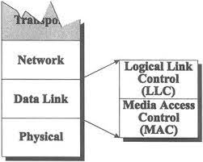
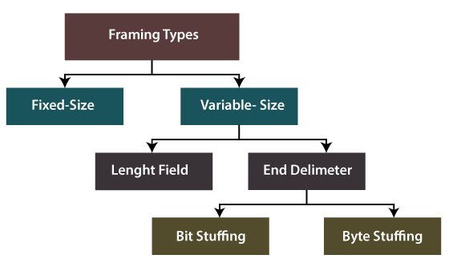

# **:material-bridge: Data Link Layer**

{width="80%", : .center} 


## **Definition**

???+question "Demand?"

    The `bitstream` can cause **errors** (see [physical layer's cons](./physical.md/#cons)) when it is transmitted on a medium. We need a **new layer** that provides {==high-quality (error free)==} data transfer services to topper layers (such as [network layer](./network.md)).

    ``` mermaid
    graph LR
        A[Network Layer] -- packets --- B[Data Link Layer]
        B -- "frames (bit-by-bit)" --- C[Physical Layer]
    ```

???+question "For?"

    `Data Link Layer` has below functions:

    1. [**Framing**](#framing).
    2. **Transparent Transmission & Addressing**.
    3. **Error Detection**.
    4. **Error Correction**
    5. **Flow Control**

## **Abstracting**

???+note "From `physical layer` to `data link layer`"

    We know that in the [`physical layer`](./physical.md), information is communicated with bit stream through cable or WIFI. 
    
    To abstract the `data link Layer`, we classify the "communication channel" in this layer into two types:

    1. **Point-to-point** communication channel (use [P2P](https://www.geeksforgeeks.org/p2ppeer-to-peer-file-sharing/) protocol).
    2. **Broadcast** communication channel (use [CSMA/CA](https://www.techtarget.com/searchnetworking/definition/CSMA-CA#:~:text=Carrier%20sense%20multiple%20access%2Fcollision%20avoidance%20(CSMA%2FCA),over%20a%20data%20link%20layer.) protocol).

???+danger "Notice!"

    To understand the `data link layer` better, we think about the case of **broadcasting** first. 
    
    [LAN](https://en.wikipedia.org/wiki/Local_area_network) (local area network) is a computer network that has the **broadcasting** function.

    Furthermore, from all the `LAN` products, we peak [`Ethernet`](https://en.wikipedia.org/wiki/Ethernet), which fllow the standard of [*DIX Ethernet V2*](https://www.ibm.com/docs/en/zvm/7.1?topic=structure-ethernet-dix-v2) or [*IEEE 802.3*](https://en.wikipedia.org/wiki/IEEE_802.3).


## **Anatomy**

???+note "Dissect the `data link layer`"

    In order to make the `data link layer` more suitable for  various `LAN` standards, the [*802 committee*](https://en. wikipedia.org/wiki/IEEE_802) divided the `data link layer` into two **sub-layers**:

    - [**Logical Link Control (LLC)**](#llc-sub-layer): provides the logic for the data link.
    - [**Medium Access Control (MAC)**](#mac-sub-layer)：provides controls for accessing the transmission medium. It is transparent to `LLC` sublayer

    {width="30%", : .center}   

    Let's go to check them one by one.

## **MAC Sub Layer**

### **Functions**

`MAC` sublayer is responsible for:

- [**Framing**](#framing)
- **Transparent Transmission & Addressing**
- **Control physical medium access**


### **Framing**

???+question "`Framing`?"

    **Encapsulate** network data (a stream of `bits`) into `frames`, which is **discernible blocks** of information.

???+question "Classifications?"

    {width="50%", : .center}     

    There are **two** types of `Framing`:

    - **Fixed-size Framing:**
    
        !!! note ""

            The `frame` is of **fixed size**. No need to add delimiters.

            ???+warning "Con"

                When the data size is **smaller** than the fixed frame size, the frame itself will suffer <u>internal fragmentation</u>. We need to `pad` it.

    - **Variable-size Framing:**
    
        !!! note ""

            The `frame` needs to indicate `begin` and `end` to be distinguished.

            ???+success "Ways to implement"

                1. `Length field` : define the length **in** the frame.

                    - **e.g.** [Ethernet (802.3)](https://en.wikipedia.org/wiki/IEEE_802.3).
                    - **Cons:** Length field may get corrupted sometimes.

                2. `ED (End Delimeter)` : add **end delimiter** (like [*Period*](https://en.wikipedia.org/wiki/Full_stop) in English).

                    - **e.g.** [Token Ring (802.5)](https://en.wikipedia.org/wiki/Token_Ring).
                    - **Cons:** The end delimiter can appear in the data.
                    - **Types:** 
                        - Character/Byte Stuffing
                        - Bit Stuffing


### **Transparent transmission**


## **LLC Sub Layer**

### **Functions**

`LLC` sublayer is responsible for:

- **Error Detection**
- **Error Correction**
- **Flow Control**


### **References**

[Picture Resource 1](https://networkencyclopedia.com/logical-link-control-llc-layer/)

[Picture Resource 2](https://www.javatpoint.com/frame)