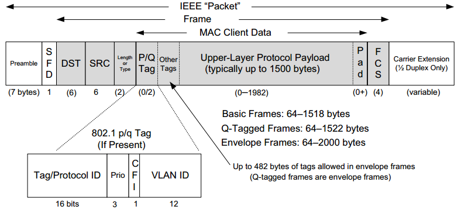
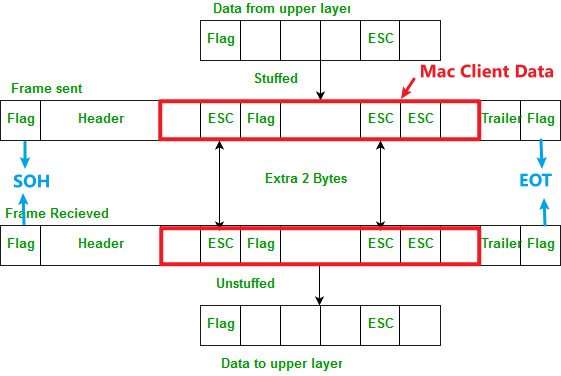

# **:material-bridge: Data Link Layer**

{width="80%", : .center} 


## **Definition**

???+question "Demand?"

    The `bitstream` can cause **errors** (see [physical layer's cons](./physical.md/#cons)) when it is transmitted on a medium. We need a **new layer** that provides {==high-quality (error free)==} data transfer services to topper layers (such as [network layer](./network.md)).

    ``` mermaid
    graph LR
        A[Network Layer] -- packets --- B[Data Link Layer]
        B -- "frames (bit-by-bit)" --- C[Physical Layer]
    ```

???+question "For?"

    `Data Link Layer` has below functions:

    1. [**Framing**](#11-framing). 
    2. [**Addressing**](#12-addressing).
    3. [**Transparent Transmission**](#13-transparent-transmission).
    4. **Error Detection**.
    5. **Error Correction**.
    6. **Flow Control**.

## **Abstracting**

???+note "From `physical layer` to `data link layer`"

    We know that in the [`physical layer`](./physical.md), information is communicated with bit stream through <u>cable or WIFI</u>. 
    
    To abstract the `data link Layer`, we classify the <u>"communication channel"</u> in this layer into two types:

    1. **Point-to-point** communication channel (use [P2P](https://www.geeksforgeeks.org/p2ppeer-to-peer-file-sharing/) protocol).
    2. **Broadcast** communication channel (use [CSMA/CA](https://www.techtarget.com/searchnetworking/definition/CSMA-CA#:~:text=Carrier%20sense%20multiple%20access%2Fcollision%20avoidance%20(CSMA%2FCA),over%20a%20data%20link%20layer.) protocol).

    {width="80%", : .center}   


???+danger "Notice!"

    To understand the `data link layer` better, we think about the case of **broadcasting** first. 
    
    [LAN](https://en.wikipedia.org/wiki/Local_area_network) (local area network) is a computer network that has the **broadcasting** function.

    Furthermore, from all the `LAN` products, we peak [`Ethernet`](https://en.wikipedia.org/wiki/Ethernet), which fllow the standard of [*DIX Ethernet V2*](https://www.ibm.com/docs/en/zvm/7.1?topic=structure-ethernet-dix-v2) or [*IEEE 802.3*](https://en.wikipedia.org/wiki/IEEE_802.3).


### **Anatomy**

???+note "Dissect the `data link layer`"

    In order to make the `data link layer` more suitable for  various `LAN` standards, the [*802 committee*](https://en. wikipedia.org/wiki/IEEE_802) divided the `data link layer` into two **sub-layers**:

    - [**Logical Link Control (LLC)**](#llc-sub-layer): provides the logic for the data link.
    - [**Medium Access Control (MAC)**](#mac-sub-layer)：provides controls for accessing the transmission medium. It is transparent to `LLC` sublayer

    {width="30%", : .center}   

> Let's go to check them one by one! 🛸🛸

## **1. MAC Sublayer**

### **Mac address**

???+question "MAC Address?"

    `MAC Address` is also called as the `physical Address` of a **network device**. `MAC Address` is used by the `MAC sublayer`. `MAC Address` is **worldwide unique** (since millions of network devices exist, we need to uniquely identify each). 

    {width="50%", : .center}


### **Functions of MAC Sublayer**

!!! note ""

    `MAC` sublayer is responsible for:

    1. [**Framing**](#11-framing)
    2. [**Addressing**](#12-addressing)
    3. [**Transparent Transmission**](#13-transparent-transmission)
    4. **Control physical medium access**


### **1.1 Framing**

!!! success ""

    ???+question "`Framing`?"

        **Transfer** network data (a stream of `bits`) into `frames`, which is **discernible blocks** of information.

    ???+question "`Frame`?"

        **Transferred** `protocol data units` (**PDU**s) in the `data link layer`.

    ???+note "Types of `Framing`"

        {width="50%", : .center}     

        There are **two** types of `Framing`:

        - **Fixed-size Framing:**

            !!! example ""

                The `frame` is of **fixed size**. No need to add delimiters.

                ???warning "Con"

                    When the data size is **smaller** than the fixed frame size, the frame itself will suffer   <u>internal fragmentation</u>. We need to `pad` it.

        - **Variable-size Framing:**

            !!! example ""

                The `frame` needs to indicate the **begin** and **end** to be distinguished.

                ???+success "Ways to implement"

                    1. `Length field` : define the length **in** the frame.

                        - **e.g.** [Ethernet (802.3)](https://en.wikipedia.org/wiki/IEEE_802.3) --> `Ethernet frame`.
                        - **Cons:** Length field may get corrupted sometimes.

                    2. `ED (End Delimeter)` : add **end delimiter** (like [*Period*](https://en.wikipedia.org/wiki/ Full_stop) in English).

                        - **e.g.** [Token Ring (802.5)](https://en.wikipedia.org/wiki/Token_Ring).
                        - **Cons:** The end delimiter can appear in the data.
                        - **Types:** 
                            - Character/Byte Stuffing (see later in [1.2 Transparent transmission](#12-transparent-transmission))
                            - Bit Stuffing

    ???+note "Schematic Diagram of `Ethernet frame`"

        Here below is the `Ethernet frame` format:

        {width="80%", : .center}   
        
        1. The **Preamble** area is used by the **receiving interface’s circuitry** to determine when a frame arrives and the amount of time between encoded bits (called `clock recovery`).
   
        2. The **SFD** and **Preamble** area indicates when the frame start.

        3. The **Basic Frame** (/Frame) field starts from the `Destination (DST)` and `Source (SRC)` address fields. 
   
        4. Both **DST** (destination) and **SRC** (source) areas are all [MAC addresses](#mac-address) or known by other names such as:
            - Link-layer address
            - 802 address
            - Hardware address
            - Physical address

        5. The **Type/Lenth** area identifies the type of data that follows the header. It is for [layer three](./network.md) using [layer two](./datalink.md) frames. It indicates which layer three's protocol is used. Popular values used with `TCP/IP` networks include:
            - IPv4 (0x0800)
            - IPv6 (0x86DD)
            - ARP (0x0806).
        6. The **DST**, **SRC**, and **Type/Lenth** are composed as the `MAC header`.

        7. In the **MAC Client Data** field, we ignore the optional parts and only focus on <u>the **Payload** area, which is the data the frame carries from source to destination. The Payload data is `encapsulated` by the [layer three](./network.md).</u>

        8. The **FCS (frame check sequence)** is used to identify any **errors** in the frame.

### **1.2 Addressing**

!!! note ""

    As we know, [`MAC address`](#mac-address) is unique for each device. Thus, we can encapsulate the unique `MAC address` -- the source (`SRC`) and destination (`DST`) address in the **header** of each `frame` to ensure **node-to-node delivery**.

### **1.3 Transparent transmission**

!!! success ""

    ???+question "What is the `transparent transmission`?"

        It describes a phenomenon of data transmission **without error**. It's as if the transmission itself doesn't exist.

    ???+question "Why?"

        - If the data transmitted is **printable characters (95 in total)** in `ASCII` code, everything is okay.
        - However, if the data transmitted contains **unprintable characters**, errors will show up.

    ???+question "How?"

        Remember [`Variable-size Framing`](#11-framing)? Besides using the `length field` to implement `frame`, we can also refer the `ED (End Delimeter)` method! Here we use `Byte Stuffing`(or `Character Stuffing`) 🐤.

    ???+note "Implement `Byte Stuffing`"

        {width="60%", : .center}


        As the diagram shows above, we give the following explanations:

        1. `Flag` can be `SOH` or `EOT`. 
        2. `SOH` is the **head part** of the frame. We can use the `Preamble`+`SFD` areas as an example.
        3. `EOT` is the **tail part** of the frame. We can use the `Carrier Extension` areas as an example.
        4. When the `MAC Client Data` field exists unprintable characters such as `Flag` (`SOH` or `EOT`) OR `ESC`, we can add an extra `escape character` -- `ESC` to **diminish ambiguation**.


### **1.4 Control physical medium access**

No more explanations here; just know it as literal meaning.

## **2. LLC Sublayer**

### **Functions**

`LLC` sublayer is responsible for:

- **Error Detection**
- **Error Correction**
- **Flow Control**


### **References**

[Picture Resource 1](https://networkencyclopedia.com/logical-link-control-llc-layer/)

[Picture Resource 2](https://www.javatpoint.com/frame)

[Picture Resource 3](https://dongknows.com/mac-address-explained/)

[Picture Resource 4](https://notes.shichao.io/tcpv1/ch3/)

[Picture Resource 5](https://media.geeksforgeeks.org/wp-content/uploads/Bit_Byte_Stuffing_1.jpg)

[Picture Resource 6](https://stucknactive.com/2019/03/02/1-12-network-types/)