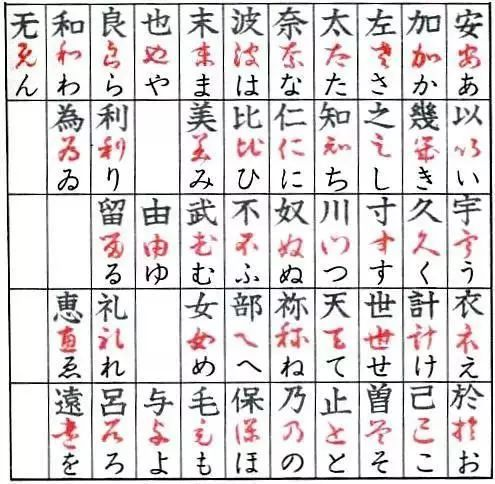
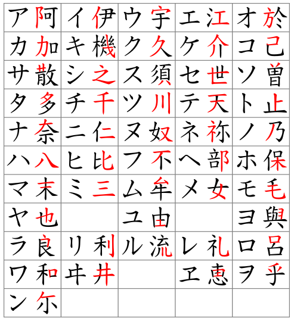
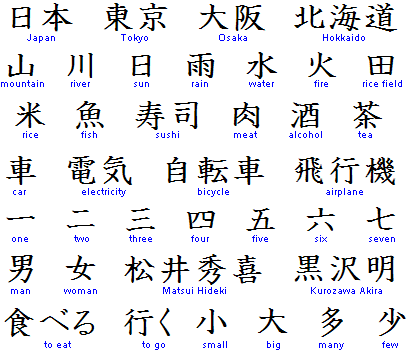

# ** 🗾 五十音図**

## **Welcome to 日本語(にほんご)**

???+question "Components?"

    There are three types of Japanese in [Japanese Writing System](https://en.wikipedia.org/wiki/Japanese_writing_system): 

    === "`hiragana (平仮名)`"

        `Hiragana` is used to express the **inherent vocabulary** and **grammatical auxiliary words** in modern Japanese.

        `Hiragana` evolved from the **cursive script (草书)** of Chinese characters. 

        {width="50%", : .center}  

        
        Early `Hiragana` was wildly used by Japanese women. It was used more for lyrical text, called female characters, female hand.
        
    === "`katakana (片仮名)`"

        `Katakana` is used for **foreign words**, **foreign names**, **onomatopoeia**, **biological**, **mineral**, etc., in modern Japanese.

        `Katakana` evolved from **regular script (楷书)** or its radicals of Chinese characters.

        {width="45%", : .center}

    === "`Kanji (漢字)`"

        `Kanji` are the **logographic Chinese characters** taken from the Chinese script and used in the writing of Japanese.

        {width="50%", : .center}  

        Early `Kanji` was wildly used by Japanese men for history, and papers, which are called male characters, male hands.
    

???+danger "Before Learning!"
    
    Since the author is Chinese, concepts will be preferred to be expressed by `(漢字)`.

## **Table for 五十音図(ごじゅうおんず)**

???+note "Introduction"

    For the table of the `五十音図`（[Kana syllabary Pro](https://en.wikipedia.org/wiki/Kana)), we call each **column** `段` and each **row** `行`. The diagram is split into diagrams for `平仮名` and `片仮名`.

#### **平仮名(ひらがな) "hiragana"**

???+success "平仮名"

    === "清音(せいおん) "seion""

        The original character writing:

        || あ(a)段 | い(i)段 | う(u)段 | え(e)段 | お(o)段 |
        | :-: | :-: | :-: | :-: | :-: | :-: |
        |**あ(a)行**|あ|い|う|え|お|
        |**か(k)行**|か|き|く|け|こ|
        |**さ(s)行**|さ|し(shi)|す|せ|そ|
        |**た(t)行**|た|ち(ti/chi)|つ(tsu)|て|と|
        |**な(n)行**|な|に|ぬ|ね|の|
        |**は(h)行**|は|ひ|ふ|へ|ほ|
        |**ま(m)行**|ま|み|む|め|も|
        |**や(y)行**|や||ゆ||よ|
        |**ら\(r)行**|ら|り|る|れ|ろ|
        |**わ(w)行**|わ||||を|
        |**ん(n)**|ん|

    === "濁音(だくおん) "dakuon""

        The character writing added with `゛`:

        || あ(a)段 | い(i)段 | う(u)段 | え(e)段 | お(o)段 |
        | :-: | :-: | :-: | :-: | :-: | :-: |
        |**あ(a)行**|あ|い|う|え|お|
        |{==**が(g)行**==}|{==**が**==}|{==**ぎ**==}|{==**ぐ**==}|{==**げ**==}|{==**ご**==}|
        |{==**ざ(z)行**==}|{==**ざ**==}|{==**じ(ji)**==}|{==**ず**==}|{==**ぜ**==}|{==**ぞ**==}|
        |{==**だ(d)行**==}|{==**だ**==}|{==**ぢ(ji)**==}|{==**づ(zu)**==}|{==**で**==}|{==**ど**==}|
        |**な(n)行**|な|に|ぬ|ね|の|
        |{==**ば(b)行**==}|{==**ば**==}|{==**び**==}|{==**ぶ**==}|{==**べ**==}|{==**ぼ**==}|
        |**ま(m)行**|ま|み|む|め|も|
        |**や(y)行**|や||ゆ||よ|
        |**ら\(r)行**|ら|り|る|れ|ろ|
        |**わ(w)行**|わ||||を|
        |**ん(n)**|ん|

    === "半濁音(はんだくおん) "handakuon""

        The character writing added with `゜`:

        || あ(a)段 | い(i)段 | う(u)段 | え(e)段 | お(o)段 |
        | :-: | :-: | :-: | :-: | :-: | :-: |
        |**あ(a)行**|あ|い|う|え|お|
        |{++**が(g)行**++}|{++**が**++}|{++**ぎ**++}|{++**ぐ**++}|{++**げ**++}|{++**ご**++}|
        |{++**ざ(z)行**++}|{++**ざ**++}|{++**じ(ji)**++}|{++**ず**++}|{++**ぜ**++}|{++**ぞ**++}|
        |{++**だ(d)行**++}|{++**だ**++}|{++**ぢ(ji)**++}|{++**づ(zu)**++}|{++**で**++}|{++**ど**++}|
        |**な(n)行**|な|に|ぬ|ね|の|
        |{==**ぱ(p)行**==}|{==**ぱ**==}|{==**ぴ**==}|{==**ぷ**==}|{==**ぺ**==}|{==**ぽ**==}|
        |**ま(m)行**|ま|み|む|め|も|
        |**や(y)行**|や||ゆ||よ|
        |**ら\(r)行**|ら|り|る|れ|ろ|
        |**わ(w)行**|わ||||を|
        |**ん(n)**|ん|

    === "長音(ちょうおん) "chouon""

        In `平仮名`, we use `あ`, `い`, `う`, `え`, and `お` to extend the pronunciation.

        || あ(a)段 {==+ あ==} | い(i)段 {==+ い==} | う(u)段 {==+ う==} | え(e)段 {==+ い==} | お(o)段 {==+ う==} |
        | :-: | :-: | :-: | :-: | :-: | :-: |
        |**あ(a)行**|あ|い|う|え|お|
        |**か(k)行**|か|き|く|け|こ|
        |**さ(s)行**|さ|し(shi)|す|せ|そ|
        |**た(t)行**|た|ち(ti/chi)|つ(tsu)|て|と|
        |**な(n)行**|な|に|ぬ|ね|の|
        |**は(h)行**|は|ひ|ふ|へ|ほ|
        |**ま(m)行**|ま|み|む|め|も|
        |**や(y)行**|や||ゆ||よ|
        |**ら\(r)行**|ら|り|る|れ|ろ|
        |**わ(w)行**|わ||||を|
        |**ん(n)**|ん|

    === "撥音(はつおん) "hatsuon""

    === "促音(そくおん) "sokuon""

    === "拗音(ようおん) "youon""

## **あ(a)行**

### **References:**

- [平假名](https://zh.wikipedia.org/wiki/%E5%B9%B3%E5%81%87%E5%90%8D)
- [片假名](https://zh.m.wikipedia.org/zh-hans/%E7%89%87%E5%81%87%E5%90%8D)
- [Kanji](https://en.wikipedia.org/wiki/Kanji)
- [picture source 1](https://upload.wikimedia.org/wikipedia/commons/thumb/0/0c/Katakana_origine.svg/480px-Katakana_origine.svg.png)
- [picture source 2](http://5b0988e595225.cdn.sohucs.com/images/20171117/23ac4afcbbe240779db6ee6766f94340.jpeg)
- [picture source 3](https://www.japan-guide.com/g4/2046_01.gif)