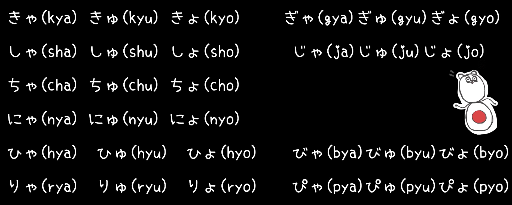

# ** 🗾 五十音図**

## **Welcome to 日本語(にほんご)**

???+question "Components?"

    There are three types of Japanese in [Japanese Writing System](https://en.wikipedia.org/wiki/Japanese_writing_system): 

    === "`hiragana (平仮名)`"

        `Hiragana` is used to express the **inherent vocabulary** and **grammatical auxiliary words** in modern Japanese.

        `Hiragana` evolved from the **cursive script (草书)** of Chinese characters. 

        {width="50%", : .center}  

        
        Early `Hiragana` was wildly used by Japanese women. It was used more for lyrical text, called female characters, female hand.
        
    === "`katakana (片仮名)`"

        `Katakana` is used for **foreign words**, **foreign names**, **onomatopoeia**, **biological**, **mineral**, etc., in modern Japanese.

        `Katakana` evolved from **regular script (楷书)** or its radicals of Chinese characters.

        {width="45%", : .center}

    === "`Kanji (漢字)`"

        `Kanji` are the **logographic Chinese characters** taken from the Chinese script and used in the writing of Japanese.

        {width="50%", : .center}  

        Early `Kanji` was wildly used by Japanese men for history, and papers, which are called male characters, male hands.
    

???+danger "Before Learning!"
    
    Since the author is Chinese, concepts will be preferred to be expressed by `(漢字)`.

## **Table for 五十音図(ごじゅうおんず)**

???+note "Introduction"

    For the table of the `五十音図`（[Kana syllabary Pro](https://en.wikipedia.org/wiki/Kana)), we call each **column** `段` and each **row** `行`. The diagram is split into diagrams for `平仮名` and `片仮名`.

#### **平仮名&片仮名**

???+success "平仮名&片仮名"

    || あ`ア`(a)段 | い`イ`(i)段 | う`ウ`(u)段 | え`エ`(e)段 | お`オ`(o)段 |
    | :-: | :-: | :-: | :-: | :-: | :-: |
    |**あ`ア`(a)行**|あ`ア`|い`イ`|う`ウ`|え`エ`|お`オ`|
    |**か`カ`(k)行**|か`カ`|き`キ`|く`ク`|け`ケ`|こ`コ`|
    |**さ`サ`(s)行**|さ`サ`|し`シ`(shi)|す`ス`|せ`セ`|そ`ソ`|
    |**た`タ`(t)行**|た`タ`|ち`チ`(ti/chi)|つ`ツ`(tsu)|て`テ`|と`ト`|
    |**な`ナ`(n)行**|な`ナ`|に`ニ`|ぬ`ヌ`|ね`ネ`|の`ノ`|
    |**は`ハ`(h)行**|は`ハ`|ひ`ヒ`|ふ`フ`|へ`ヘ`|ほ`ホ`|
    |**ま`マ`(m)行**|ま`マ`|み`ミ`|む`ム`|め`メ`|も`モ`|
    |**や`ヤ`(y)行**|や`ヤ`||ゆ`ユ`||よ`ヨ`|
    |**ら`ラ`\(r)行**|ら`ラ`|り`リ`|る`ル`|れ`レ`|ろ`ロ`|
    |**わ`ワ`(w)行**|わ`ワ`||||を`ヲ`|
    |**ん`ン`(n)**|ん`ン`|

#### **平仮名(ひらがな) "hiragana"**

???success "平仮名"

    || あ(a)段 | い(i)段 | う(u)段 | え(e)段 | お(o)段 |
    | :-: | :-: | :-: | :-: | :-: | :-: |
    |**あ(a)行**|あ|い|う|え|お|
    |**か(k)行**|か|き|く|け|こ|
    |**さ(s)行**|さ|し(shi)|す|せ|そ|
    |**た(t)行**|た|ち(ti/chi)|つ(tsu)|て|と|
    |**な(n)行**|な|に|ぬ|ね|の|
    |**は(h)行**|は|ひ|ふ|へ|ほ|
    |**ま(m)行**|ま|み|む|め|も|
    |**や(y)行**|や||ゆ||よ|
    |**ら\(r)行**|ら|り|る|れ|ろ|
    |**わ(w)行**|わ||||を|
    |**ん(n)**|ん|

#### **片仮名(かたかな) "katakana"**

???success "片仮名"

    || ア(a)段 | イ(i)段 | ウ(u)段 | エ(e)段 | オ(o)段 |
    | :-: | :-: | :-: | :-: | :-: | :-: |
    |**ア(a)行**|ア|イ|ウ|エ|オ|
    |**カ(k)行**|カ|キ|ク|ケ|コ|
    |**サ(s)行**|サ|シ(shi)|ス|セ|ソ|
    |**タ(t)行**|タ|チ(ti/chi)|ツ(tsu)|テ|ト|
    |**ナ(n)行**|ナ|ニ|ヌ|ネ|ノ|
    |**ハ(h)行**|ハ|ヒ|フ|ヘ|ホ|
    |**マ(m)行**|マ|ミ|ム|メ|モ|
    |**ヤ(y)行**|ヤ||ユ||ヨ|
    |**ラ\(r)行**|ラ|リ|ル|レ|ロ|
    |**ワ(w)行**|ワ||||ヲ|
    |**ン(n)**|ン|

#### **おん "on"**

???success "おん"

    === "清音(せいおん) "seion""

        The original character writing:

        || あ`ア`(a)段 | い`イ`(i)段 | う`ウ`(u)段 | え`エ`(e)段 | お`オ`(o)段 |
        | :-: | :-: | :-: | :-: | :-: | :-: |
        |**あ`ア`(a)行**|あ`ア`|い`イ`|う`ウ`|え`エ`|お`オ`|
        |**か`カ`(k)行**|か`カ`|き`キ`|く`ク`|け`ケ`|こ`コ`|
        |**さ`サ`(s)行**|さ`サ`|し`シ`(shi)|す`ス`|せ`セ`|そ`ソ`|
        |**た`タ`(t)行**|た`タ`|ち`チ`(ti/chi)|つ`ツ`(tsu)|て`テ`|と`ト`|
        |**な`ナ`(n)行**|な`ナ`|に`ニ`|ぬ`ヌ`|ね`ネ`|の`ノ`|
        |**は`ハ`(h)行**|は`ハ`|ひ`ヒ`|ふ`フ`|へ`ヘ`|ほ`ホ`|
        |**ま`マ`(m)行**|ま`マ`|み`ミ`|む`ム`|め`メ`|も`モ`|
        |**や`ヤ`(y)行**|や`ヤ`||ゆ`ユ`||よ`ヨ`|
        |**ら`ラ`\(r)行**|ら`ラ`|り`リ`|る`ル`|れ`レ`|ろ`ロ`|
        |**わ`ワ`(w)行**|わ`ワ`||||を`ヲ`|
        |**ん`ン`(n)**|ん`ン`|

    === "濁音(だくおん) "dakuon""

        The character writing added with `゛`:

        || あ`ア`(a)段 | い`イ`(i)段 | う`ウ`(u)段 | え`エ`(e)段 | お`オ`(o)段 |
        | :-: | :-: | :-: | :-: | :-: | :-: |
        |**あ`ア`(a)行**|あ`ア`|い`イ`|う`ウ`|え`エ`|お`オ`|
        |{==**が`ガ`(g)行**==}|{==**が`ガ`**==}|{==**ぎ`ギ`**==}|{==**ぐ`グ`**==}|{==**げ`ゲ`**==}|{==**ご`ゴ`**==}|
        |{==**ざ`ザ`(z)行**==}|{==**ざ`ザ`**==}|{==**じ`ジ`(ji)**==}|{==**ず`ズ`**==}|{==**ぜ`ゼ`**==}|{==**ぞ`ゾ`**==}|
        |{==**だ`ダ`(d)行**==}|{==**だ`ダ`**==}|{==**ぢ`ヂ`(ji)**==}|{==**づ`ヅ`(zu)**==}|{==**で`デ`**==}|{==**ど`ド`**==}|
        |**な`ナ`(n)行**|な`ナ`|に`ニ`|ぬ`ヌ`|ね`ネ`|の`ノ`|
        |{==**ば`バ`(b)行**==}|{==**ば`バ`**==}|{==**び`ビ`**==}|{==**ぶ`ブ`**==}|{==**ベ`ベ`**==}|{==**ぼ`ボ`**==}|
        |**ま`マ`(m)行**|ま`マ`|み`ミ`|む`ム`|め`メ`|も`モ`|
        |**や`ヤ`(y)行**|や`ヤ`||ゆ`ユ`||よ`ヨ`|
        |**ら`ラ`\(r)行**|ら`ラ`|り`リ`|る`ル`|れ`レ`|ろ`ロ`|
        |**わ`ワ`(w)行**|わ`ワ`||||を`ヲ`|
        |**ん`ン`(n)**|ん`ン`|

    === "半濁音(はんだくおん) "handakuon""

        The character writing added with `゜`:

        || あ`ア`(a)段 | い`イ`(i)段 | う`ウ`(u)段 | え`エ`(e)段 | お`オ`(o)段 |
        | :-: | :-: | :-: | :-: | :-: | :-: |
        |**あ`ア`(a)行**|あ`ア`|い`イ`|う`ウ`|え`エ`|お`オ`|
        |{++が`ガ`(g)行++}|{++が`ガ`++}|{++ぎ`ギ`++}|{++ぐ`グ`++}|{++げ`ゲ`++}|{++ご`ゴ`++}|
        |{++ざ`ザ`(z)行++}|{++ざ`ザ`++}|{++じ`ジ`(ji)++}|{++ず`ズ`++}|{++ぜ`ゼ`++}|{++ぞ`ゾ`++}|
        |{++だ`ダ`(d)行++}|{++だ`ダ`++}|{++ぢ`ヂ`(ji)++}|{++づ`ヅ`(zu)++}|{++で`デ`++}|{++ど`ド`++}|
        |**な`ナ`(n)行**|な`ナ`|に`ニ`|ぬ`ヌ`|ね`ネ`|の`ノ`|
        |{==**ぱ`パ`(p)行**==}|{==**ぱ`パ`**==}|{==**ぴ`ピ`**==}|{==**ぷ`プ`**==}|{==**ぺ`ペ`**==}|{==**ぽ`ポ`**==}|
        |**ま`マ`(m)行**|ま`マ`|み`ミ`|む`ム`|め`メ`|も`モ`|
        |**や`ヤ`(y)行**|や`ヤ`||ゆ`ユ`||よ`ヨ`|
        |**ら`ラ`\(r)行**|ら`ラ`|り`リ`|る`ル`|れ`レ`|ろ`ロ`|
        |**わ`ワ`(w)行**|わ`ワ`||||を`ヲ`|
        |**ん`ン`(n)**|ん`ン`|

    === "長音(ちょうおん) "chouon""

        - In `平仮名`, we use `あ`, `い`, `う`, `え`, and `お` to extend the pronunciation.
        - In `片仮名`, we use `ー` to extend the pronunciation.

        || あ(a)段 {==+ あ==} | い(i)段 {==+ い==} | う(u)段 {==+ う==} | え(e)段 {==+ い==} | お(o)段 {==+ う==} |
        | :-: | :-: | :-: | :-: | :-: | :-: |
        |**...**|

    === "撥音(はつおん) "hatsuon""

        The `んン` at the end of `五十音図`.

    === "促音(そくおん) "sokuon""

        Add `つツ(tsu)` to express a short pause.

        **E.g:** `おと`"oto" --> `お{==つ==}と`"ot_to".

    === "拗音(ようおん) "youon""

        The tiny version of `やヤ`, `ゆユ`, and `よヨ`: **`ゃャ`, `ゅュ`, and `ょョ`**

        The characters can add `拗音`:

        || あ`ア`(a)段 | {==い`イ`(i)段==} | う`ウ`(u)段 | え`エ`(e)段 | お`オ`(o)段 |
        | :-: | :-: | :-: | :-: | :-: | :-: |
        |**あ`ア`(a)行**|あ`ア`|{==い`イ`==}|う`ウ`|え`エ`|お`オ`|
        |**か`カ`(k)行**|か`カ`|{==き`キ`==}|く`ク`|け`ケ`|こ`コ`|
        |**さ`サ`(s)行**|さ`サ`|{==し`シ`==}(shi)|す`ス`|せ`セ`|そ`ソ`|
        |**た`タ`(t)行**|た`タ`|{==ち`チ`==}(ti/chi)|つ`ツ`(tsu)|て`テ`|と`ト`|
        |**な`ナ`(n)行**|な`ナ`|{==に`ニ`==}|ぬ`ヌ`|ね`ネ`|の`ノ`|
        |**は`ハ`(h)行**|は`ハ`|{==ひ`ヒ`==}|ふ`フ`|へ`ヘ`|ほ`ホ`|
        |**ま`マ`(m)行**|ま`マ`|{==み`ミ`==}|む`ム`|め`メ`|も`モ`|
        |**や`ヤ`(y)行**|や`ヤ`||ゆ`ユ`||よ`ヨ`|
        |**ら`ラ`\(r)行**|ら`ラ`|{==り`リ`==}|る`ル`|れ`レ`|ろ`ロ`|
        |**わ`ワ`(w)行**|わ`ワ`||||を`ヲ`|
        |**ん`ン`(n)**|ん`ン`|

        **E.g:** {width="60%", : .center}  

## **あ(a)行**

### **References:**

- [平假名](https://zh.wikipedia.org/wiki/%E5%B9%B3%E5%81%87%E5%90%8D)
- [片假名](https://zh.m.wikipedia.org/zh-hans/%E7%89%87%E5%81%87%E5%90%8D)
- [Kanji](https://en.wikipedia.org/wiki/Kanji)
- [picture source 1](https://upload.wikimedia.org/wikipedia/commons/thumb/0/0c/Katakana_origine.svg/480px-Katakana_origine.svg.png)
- [picture source 2](http://5b0988e595225.cdn.sohucs.com/images/20171117/23ac4afcbbe240779db6ee6766f94340.jpeg)
- [picture source 3](https://www.japan-guide.com/g4/2046_01.gif)
- [picture source 4](https://www.youtube.com/watch?v=4cKZha88Ito&list=PLuNucubP18snvU3Zz8FXF-kACs5EPK4XU&index=3)